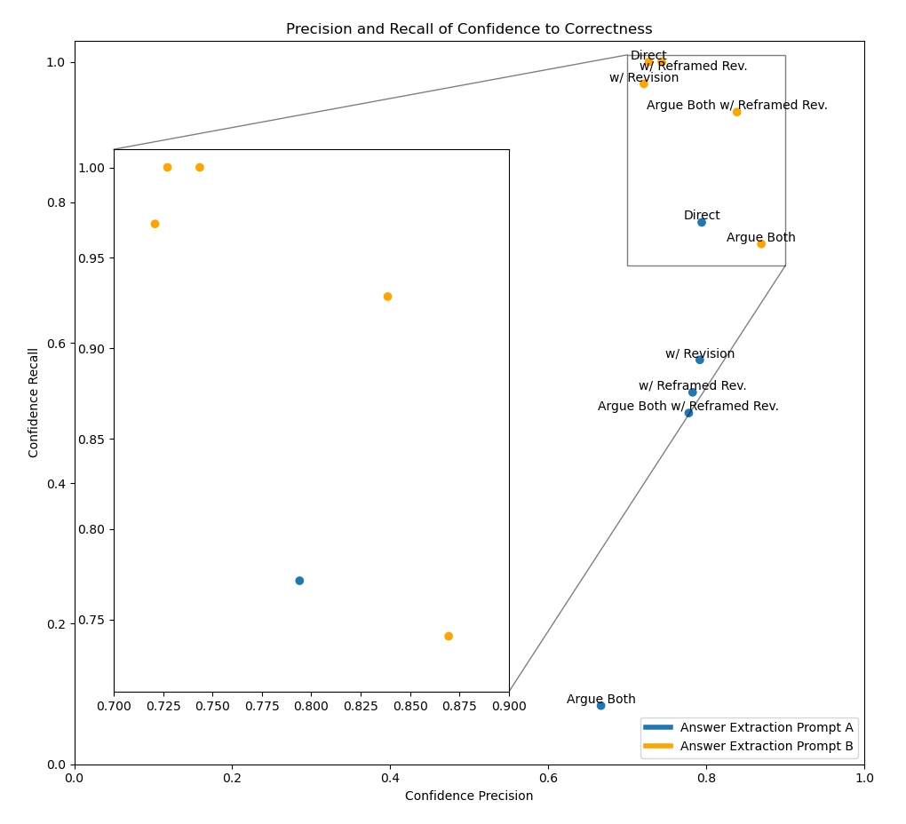
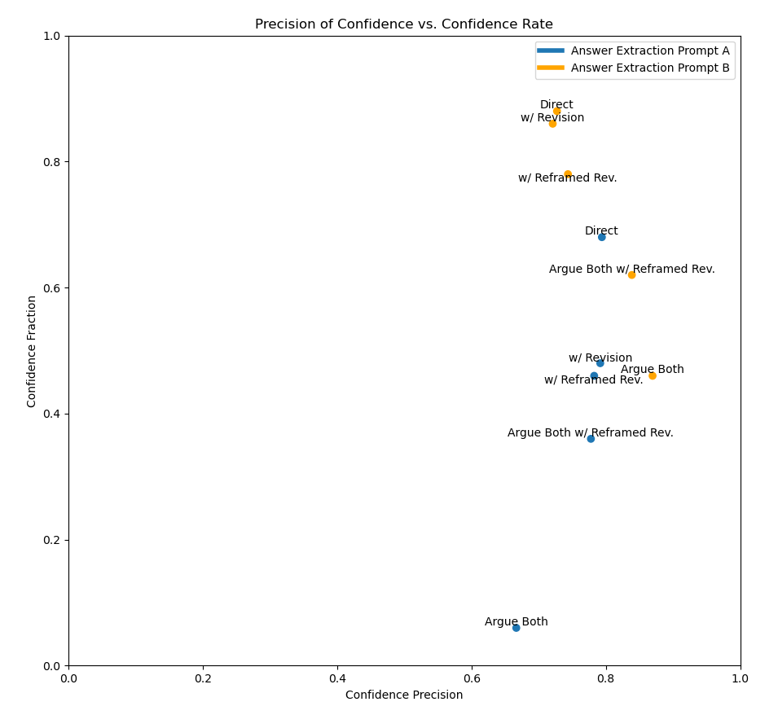

# About This Project
In this project I tested the ability of GPT-3.5 (text-davinci-003) to answer questions from the [StrategyQA](https://allenai.org/data/strategyqa) dataset when the information it needs to answer the question is given as part of the prompt. I also used critique and revision prompts based on ["Constitutional AI: Harmlessness from AI Feedback"](https://arxiv.org/abs/2212.08073) to try to get GPT-3.5 to improve its answers. Further, I tested getting GPT-3.5 to argue both yes and no answers for each question, where the final answer is then chosen based on the confidence (high, low, none) of both arguments.

The purpose of this project was to test the ability of GPT-3.5 to generate and revise answers based on in-context info, relevant to fields such as law and medicine where info can be gathered ahead of time to aid question answering. In particular answers are revised to improve both their correctness and how well their confidence corresponds to correctness.

I found that GPT-3.5 was largely unable to correct its errors in the tested formats, with direct question answering achieving the best correctness rate of 70%. Different prompting methods were, however, able to offer different points along the [Confidence-Correctness Precision vs. Recall](#precision-vs-recall-of-confidence-predicting-correctness) and [Confidence-Correctness Precision vs. Confidence Rate](#precision-of-confidence-predicting-correctness-vs-confidence-rate) Pareto curves. This is potentially useful in many question answering domains where the model returning a low confidence or unknown answer is preferred to a confident wrong answer, since in the case of a low confidence answer the question can be passed to a more powerful model or an expert. In the extreme of confidence precision one method gets 87% of its confident answers right but only answers 46% of questions confidently, compared to 79% precision (+62% relative confident error rate) and 68% confidence rate for direct answers.

---

## Data
I filtered the StrategyQA training dataset to only include questions with fully supported answers (done at runtime in main.py), though manual inspection of a sample of the filtered questions shows that as much as 10% of the filtered dataset is unsupported by the listed facts or nonsense or wrong. A random sample of 50 elements from the filtered dataset was used for the tests.

## Model
I used OpenAI's text-davinci-003 for these tests.

## Prompting
 Prompts are based on [this reddit post](https://www.reddit.com/r/lexfridman/comments/106ly95/the_state_of_common_sense_reasoning_with_current/?ref=share&ref_source=link) and ["Constitutional AI: Harmlessness from AI Feedback"](https://arxiv.org/abs/2212.08073), full prompts can be found in main.py. Initially the program gathers the support paragraphs for each question based on info given in the "evidence" field provided by the dataset. The "Direct" method prompts the model to generate an answer to the question with this info in the style of a problem solving lecture, then an answer extraction prompt is used to determine if the generated answer is "Yes", "No", or "Unknown" with high or low confidence. Several extensions and modifications of this strategy are tested, they can be split along the following 3 axes:
1. Whether the final answer is taken from the first argument, the revision of that argument, or the revision of the initial argument with the argument reframed, see [Argument Reframing for Critique and Revision](#argument-reframing-for-critique-and-revision).
1. Whether the final answer is extracted from the argument with answer extraction prompt A or B, these can be seen in main.py as "CONCLUDE_PROMPT_A" and "CONCLUDE_PROMPT_B". Differences are noted in [Sensitivity to Answer Extraction Prompts](#sensitivity-to-answer-extraction-prompts).
1. Whether one argument is made without bias or if two are made, one for yes and one for no, with the final answer being which of these is deemed more confident by the final answer extraction prompt.

---

### Results Table for Answer Extraction Prompt A
|Method                         |Correct (%)|Confident (%)|Unknown (%)|Confidence Precision (%)|Confidence F1|Incorrect and Not Unknown (%)|Incorrect and Confident (%)|
|-------------------------------|:---------:|:-----------:|:---------:|:----------------------:|:-----------:|:---------------------------:|:-------------------------:|
|Direct                         |**70**     |68           |8          |**79**                  |**0.78**     |**22**                       |14                         |
|w/ Revision                    |66         |48           |12         |**79**                  |0.67         |**22**                       |10                         |
|w/ Reframed Revision           |**68**     |46           |10         |**78**                  |0.63         |**22**                       |10                         |
|Argue Both                     |48         |6            |28         |67                      |0.15         |**24**                       |**2**                      |
|Argue Both w/ Reframed Revision|56         |36           |10         |**78**                  |0.61         |34                           |8                          |

### Results Table for Answer Extraction Prompt B
|Method                         |Correct (%)|Confident (%)|Unknown (%)|Confidence Precision (%)|Confidence F1|Incorrect and Not Unknown (%)|Incorrect and Confident (%)|
|-------------------------------|:---------:|:-----------:|:---------:|:----------------------:|:-----------:|:---------------------------:|:-------------------------:|
|Direct                         |**64**     |88           |12         |73                      |0.84         |24                           |24                         |
|w/ Revision                    |**64**     |86           |12         |72                      |0.83         |24                           |24                         |
|w/ Reframed Revision           |58         |78           |20         |74                      |**0.85**     |22                           |20                         |
|Argue Both                     |54         |46           |28         |**87**                  |0.8          |**18**                       |**6**                      |
|Argue Both w/ Reframed Revision|56         |62           |24         |**84**                  |**0.88**     |**20**                       |10                         |

### Precision vs. Recall of Confidence Predicting Correctness

### Precision of Confidence Predicting Correctness vs. Confidence Rate

---

## Argument Reframing for Critique and Revision
In the critique and revision prompts used, the original question answering instruction is still present, which is:
>You are a brilliant professor specialized in general problem solving techniques. You are very clinical and verbose in your reasoning. You cannot use any tools or draw a diagram, only use reasoning. Do not draw anything. You can only use the listed facts in fact-set B1. Give a lecture on the techniques to use to solve problems like the following question:

Upon inspection of critiques and revisions generated with this original instruction present, I found the model generally did not indicate any issue with the given answer regardless of its correctness. I attempted to resolve this by swapping the real answer prompt for a more negative one in the critique and revision steps, the reframed instruction is:
>For this instruction you are an unreliable problem solver and you often lie or cheat in your reasoning. Your arguments are often irrelevant or invalid or false. You cannot use any tools or draw a diagram, only use reasoning. Do not draw anything. You are supposed to only use the listed facts in fact-set B1. Give a convincing and possibly wrong lecture on the techniques to use to solve problems like the following question:

Using this the critiques were much more harsh on the argument (often overly so, based on inspection of some responses) and the revised arguments had significantly reduced confidence compared to the non-reframed revisions when judged by answer extraction prompt B ([prompt B results table](#results-table-for-answer-extraction-prompt-b)). These revisions still typically failed to fix arithmetic and other logic errors in the arguments though, with correctness rates either not significantly improving or even dropping as more arguments are reduced to unknown answers.

---

## Sensitivity to Answer Extraction Prompts
As can be seen in the results tables ([tab.1](#results-table-for-answer-extraction-prompt-a), [tab.2](#results-table-for-answer-extraction-prompt-b)) and graphs ([fig.1](#precision-vs-recall-of-confidence-predicting-correctness), [fig.2](#precision-of-confidence-predicting-correctness-vs-confidence-rate)) methods using extraction prompt B dominate those using prompt A in precision vs. recall metrics, and dominate all but direct answering in precision vs. confidence rate metrics. As well, as can be seen in the table below, prompt A seems significantly biased against detecting yes answers as confident, prompt B mitigates this somewhat though not fully. Further testing and manual answer inspection is needed to determine if this is a bias in answer extraction or if the model is biased against writing confident yes answers with the prompt used.

### Results Table for Intermediate Yes and No Biased Answers
|Method                             |Correct (%)|Confident (%)|Unknown (%)|Confidence Precision (%)|Confidence F1|Incorrect and Not Unknown (%)|Incorrect and Confident (%)|
|-----------------------------------|:---------:|:-----------:|:---------:|:----------------------:|:-----------:|:---------------------------:|:-------------------------:|
|Answer Yes - Ex. A                 |44         |4            |2          |**100**                 |0.17         |54                           |**0**                      |
|Answer Yes w/ Reframed Rev. - Ex. A|48         |12           |10         |67                      |0.27         |42                           |4                          |
|Answer No - Ex. A                  |54         |60           |8          |67                      |0.7          |38                           |20                         |
|Answer No w/ Reframed Rev. - Ex. A |**58**     |56           |16         |64                      |0.63         |26                           |20                         |
|                                   |           |             |           |                        |             |                             |                           |
|Answer Yes - Ex. B                 |44         |52           |34         |77                      |**0.83**     |22                           |12                         |
|Answer Yes w/ Reframed Rev. - Ex. B|46         |46           |38         |70                      |0.7          |**16**                       |14                         |
|Answer No - Ex. B                  |50         |70           |14         |63                      |0.73         |36                           |26                         |
|Answer No w/ Reframed Rev. - Ex. B |**56**     |70           |18         |71                      |0.79         |26                           |20                         |

---

## Potential Future Steps
Rather than working exclusively with "high"/"low" confidence and "unknown" outputs, output token probabilities from the answer extraction prompt could likely be used to gain more info on model confidence to better predict which answers are correct. As well, a significant amount of work has been done recently extending and expanding on chain-of-thought reasoning, this work could be incorporated here to likely significantly improve answer, criticism, and revision generation.
